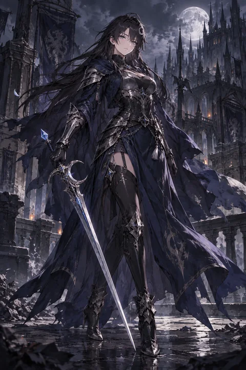
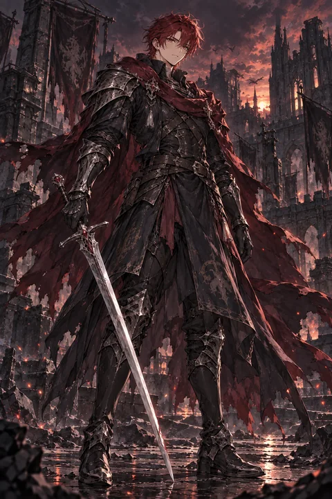
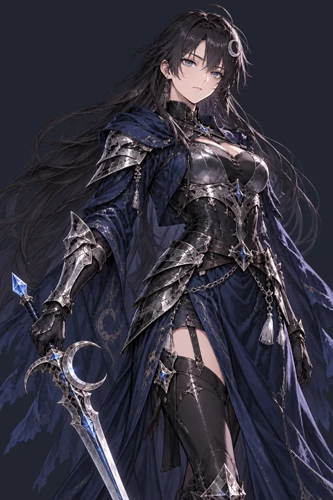
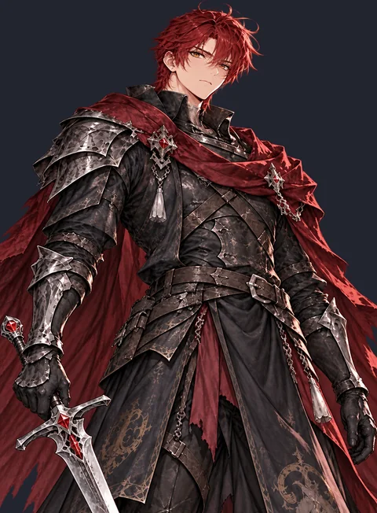
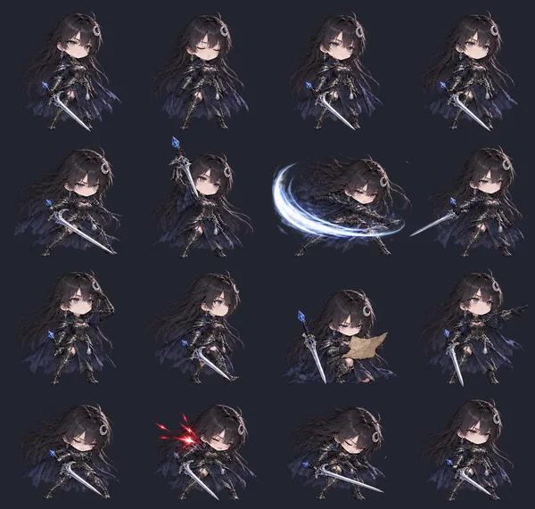
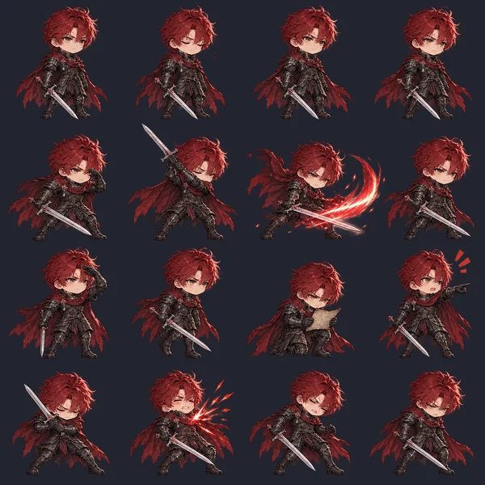
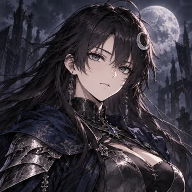
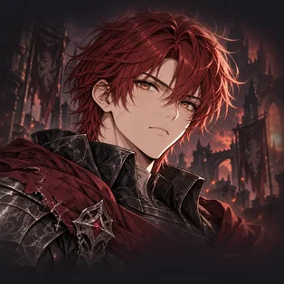

# twig-skill

Personal AI skills for game development, maintained for OpenAI/Codex, Claude, and Grok.

## Skills

### [Game Character Art](skills/game-character-art/spec.md)

Creates a consistent character asset set containing `full.png`, `chat.png`, `grid.png`, and `icon.png`.

- [OpenAI / Codex adapter](skills/game-character-art/providers/openai/SKILL.md)
- [Claude adapter](skills/game-character-art/providers/claude/SKILL.md)
- [Grok adapter](skills/game-character-art/providers/grok/SKILL.md)
- [Prompt scaffolds](skills/game-character-art/prompts/assets.md)
- [Official style masters and SHA-256 lock](skills/game-character-art/references/official-style-lock.json)

#### Samples

| Asset | Moonlight swordswoman | Crimson swordsman |
| --- | --- | --- |
| Full | <a href="examples/game-character-art/moonlight-swordswoman.webp"></a> | <a href="examples/game-character-art/crimson-swordsman.webp"></a> |
| Chat | <a href="examples/game-character-art/moonlight-swordswoman-chat.webp"></a> | <a href="examples/game-character-art/crimson-swordsman-chat.webp"></a> |
| Grid | <a href="examples/game-character-art/moonlight-swordswoman-grid.webp"></a> | <a href="examples/game-character-art/crimson-swordsman-grid.webp"></a> |
| Icon | <a href="examples/game-character-art/moonlight-swordswoman-icon.webp"></a> | <a href="examples/game-character-art/crimson-swordsman-icon.webp"></a> |

## Layout

Each skill keeps provider-independent requirements in `spec.md`, reusable visual references under `references/`, and provider adapters under `providers/`.

```text
skills/<skill>/
├─ spec.md
├─ references/
├─ prompts/
└─ providers/
   ├─ openai/SKILL.md
   ├─ claude/SKILL.md
   └─ grok/SKILL.md
```

Install or link the provider directory required by the AI environment together with the skill's `spec.md`, prompts, and references. Generated game assets belong in the consuming game repository and are excluded here. The eight user-approved master images under `references/official/` are included to keep the skill's style lock portable.
